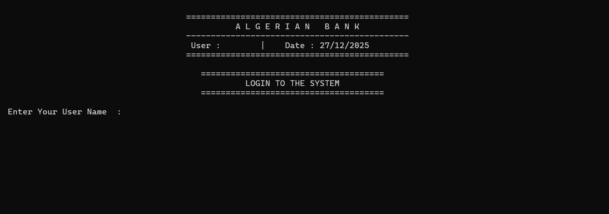
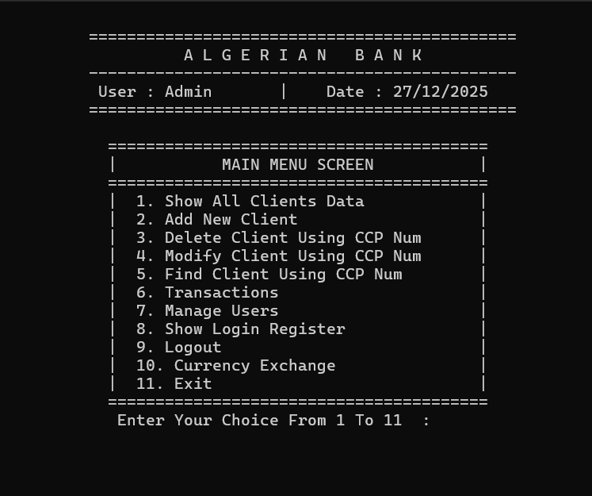
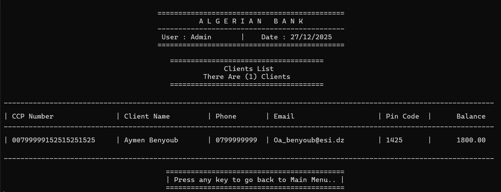
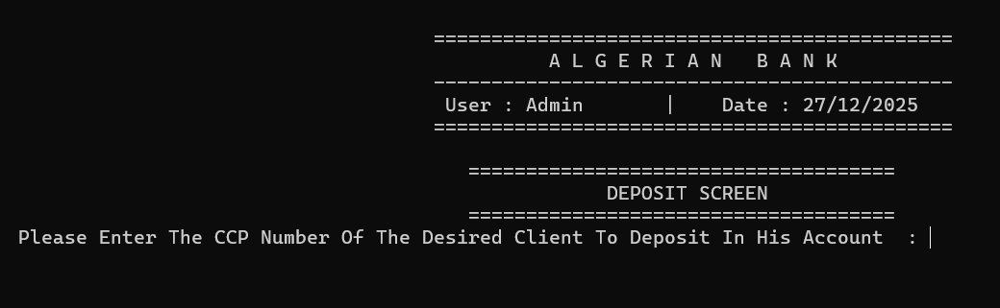
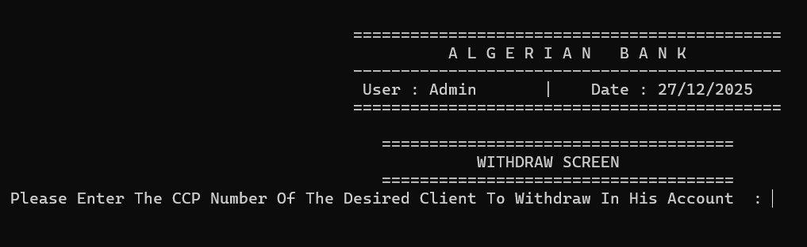
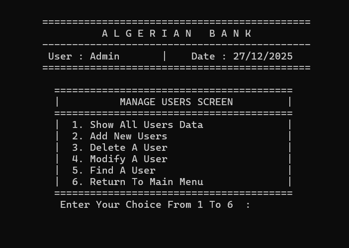
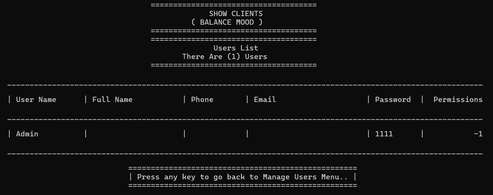
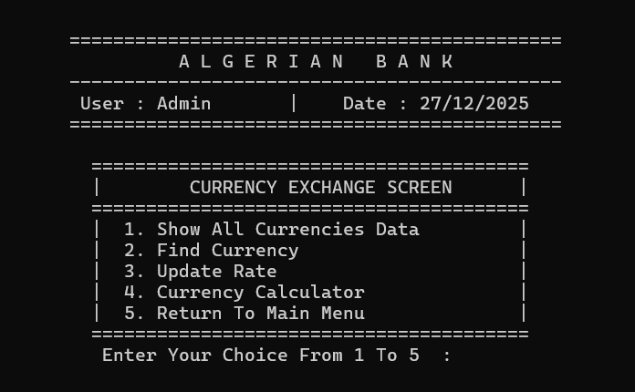

# Algerian National Bank Management System

A comprehensive desktop banking application developed in **C++** using **Object-Oriented Programming (OOP)** principles.

---

## 🎯 Key Features

### Core Banking Operations
- **Client Management**: Add, view, update, and delete client accounts
- **Deposit & Withdrawal**: Process deposits and withdrawals with balance validation
- **Money Transfer**: Transfer funds between client accounts
- **Balance Inquiry**: View client balances and account details

### User Management
- **User Accounts**: Create and manage bank staff accounts with secure password encryption
- **Role-Based Access Control**: 8 different permission types:
  - List Clients
  - Add New Clients
  - Delete Clients
  - Update Clients
  - Find Clients
  - Process Transactions
  - Manage Users
  - View Login Register

### Currency Exchange
- **Multi-Currency Support**: View exchange rates for multiple currencies
- **Currency Conversion**: Calculate conversions between different currencies
- **Rate Management**: Update exchange rates

### Transaction History & Logging
- **Login Register**: Track all user login activities
- **Transfer Register**: Record all money transfers between accounts

---

## 📸 Project Screenshots

### Login Screen

*Enter with default credentials: Admin / 1111*

### Main Menu


### Client Management



### Transaction Operations




### User Management




### Currency Exchange


---

## 🚀 Quick Start Guide

### First Login
```
Username: Admin
Password: 1111
```

The Admin account has **full permissions** and can access all features:
- ✅ Manage all clients
- ✅ Process all transactions
- ✅ Manage all users
- ✅ View activity logs
- ✅ Manage currency exchange

### Main Menu Options
1. Show All Clients
2. Add New Client
3. Delete Client
4. Update Client
5. Find Client
6. Transactions
7. Manage Users
8. Login Register
9. Logout
10. Currency Exchange
11. Exit

### Create Your Own Admin Account
1. Login as Admin
2. Go to "Manage Users" → "Add New User"
3. Create a new account
4. Give it full access
5. Use this account for future logins

---

## 🔐 Default Credentials

### Admin Account
```
Username: Admin
Password: 1111
Permissions: Full Access
```

### Creating New Users

**Permission Flags:**
- `pListClients = 1` - View client list
- `pAddNewClient = 2` - Create new clients
- `pDeleteClient = 4` - Delete clients
- `pUpdateClients = 8` - Modify client information
- `pFindClient = 16` - Search for clients
- `pTransactions = 32` - Process deposits/withdrawals/transfers
- `pManageUsers = 64` - Create/edit/delete users
- `pShowLoginReg = 128` - View login history

**Example Combinations:**
- Full Access: `-1` (Admin)
- Transaction Officer: `1 + 2 + 8 + 16 + 32 = 59`
- Customer Service: `1 + 16 = 17`

---

## 🏗️ Architecture

### Core Classes
- `clsBankClient` - Client data management
- `clsBankUser` - User accounts and permissions
- `clsCurrency` - Currency data and rates
- `clsRegisterLogins` - Login tracking
- `clsRegisterTransfer` - Transfer logging

### Screen Classes
- `clsScreen` - Base UI class
- `clsAddNewClientScreen` - Add clients
- `clsShowAllClientsScreen` - View clients
- `clsDepositScreen` - Deposit transactions
- `clsWithdrawScreen` - Withdrawal transactions
- `clsTransferScreen` - Money transfers
- `clsMainMenu` - Main navigation
- `clsManageUsersMenu` - User management
- `clsCurrencyExchangeMenu` - Currency operations

### Supporting Libraries
- `clsInputValidation` - Input validation with regex
- `clsString` - String utilities
- `clsDate` - Date operations
- `clsPerson` - Base person class

---

## 🔐 Security Features

### Authentication
- Username and password verification
- 3-attempt login limit
- Password encryption (XOR key=3)
- PIN encryption (XOR key=4)

### Data Protection
- Encrypted data storage
- File-based persistence
- Confirmation dialogs for critical operations

---

## 💾 Data Storage

Files used for data persistence:
- `Data/Clients.txt` - Client accounts
- `Data/Users.txt` - User accounts
- `Data/Currencies.txt` - Currency data
- `Data/LoginRegister.txt` - Login logs
- `Data/TransferRegister.txt` - Transfer logs

---

## ✅ Input Validation

Comprehensive validation using Regular Expressions:

```
CCP Number:  00799999[0-9]{12}
Phone:       0[4-7][0-9]{8} (Algerian format)
Email:       standard email format
PIN Code:    [0-9]{4}
Password:    [A-Za-z0-9._%+-]{6}
```

---

## 📋 Technical Stack

- **Language**: C++
- **Paradigm**: Object-Oriented Programming
- **Storage**: File-based (Text files)
- **UI**: Console-based
- **Validation**: Regular Expressions

---

## 🚀 System Requirements

- C++ Compiler (C++11 or later)
- Windows, Linux, or macOS
- 512 MB RAM
- 10 MB disk space

---

## 📥 Installation & Setup

### Prerequisites
- **Visual Studio Community Edition** (FREE) - [Download here](https://visualstudio.microsoft.com/vs/community/)
  - ✅ Best for compiling and testing C++ projects
  - ✅ Built-in debugger for examining code closely
  - ✅ IntelliSense for easy code navigation
  - ✅ Includes all necessary C++ runtime libraries

### Installation Steps

#### 1. Install Visual Studio Community
1. Download [Visual Studio Community](https://visualstudio.microsoft.com/vs/community/) (100% FREE)
2. Run the installer
3. Select **"Desktop development with C++"** workload
4. Click Install (this may take 15-30 minutes)

#### 2. Clone the Repository
Open **Command Prompt** or **Git Bash** and run:
```bash
git clone https://github.com/Aymen-Benyoub/BankingSystemProject_OOP_Version.git
```

#### 3. Navigate to Project Directory
```bash
cd BankingSystemProject_OOP_Version\BANKING_SYSTEM
```

#### 4. Run the Application
```bash
BANKING_SYSTEM.exe
```

### First Login
```
Username: Admin
Password: 1111
```

---

## 🔧 Opening in Visual Studio (Optional)

If you want to **view, modify, or debug the code**:

1. Open **Visual Studio Community**
2. Click **File → Open → Project/Solution**
3. Navigate to `BankingSystemProject_OOP_Version\BANKING_SYSTEM`
4. Open the `.sln` solution file (or the main `.cpp` file)
5. Press **F5** to compile and run with debugging
6. Or press **Ctrl+F5** to run without debugging

### Benefits of Using Visual Studio:
- 🔍 **Step through code line-by-line** with the debugger
- 📖 **View variable values** during runtime
- 🎯 **Set breakpoints** to pause execution
- 💡 **IntelliSense** for auto-completion and documentation
- 🐛 **Easy error detection** and fixing

---

## 🚀 Quick Start

### Method 1: Direct Execution (Fast)
```bash
git clone https://github.com/Aymen-Benyoub/BankingSystemProject_OOP_Version.git
cd BankingSystemProject_OOP_Version\BANKING_SYSTEM
BANKING_SYSTEM.exe
```

### Method 2: Open in Visual Studio (For Development)
1. Clone the repository
2. Open Visual Studio Community
3. Open the project from `BANKING_SYSTEM` folder
4. Press **F5** to run

---
---

## 📊 Example Usage

### Add a New Client
1. Login as Admin
2. Main Menu → Option 2 (Add New Client)
3. Enter CCP Number, name, phone, email, PIN, balance
4. System validates and saves client

### Process a Deposit
1. Main Menu → Option 6 (Transactions)
2. Transactions Menu → Option 1 (Deposit)
3. Enter client CCP number
4. Confirm amount
5. Balance updated

### Create a User Account
1. Main Menu → Option 7 (Manage Users)
2. Users Menu → Option 2 (Add New User)
3. Enter username and personal details
4. Set permissions
5. User created and ready to login

---

## 📝 Future Enhancements

- Database backend (SQL/MySQL)
- GUI interface (Qt/Windows Forms)
- Advanced encryption (AES, RSA)
- Transaction reports and analytics
- Mobile app integration
- REST API
- Loan management
- Interest calculations
- PDF reports

---

## 📄 License

Open-source for educational purposes.

---

## 👨‍💻 Author

**Aymen Benyoub**

---
